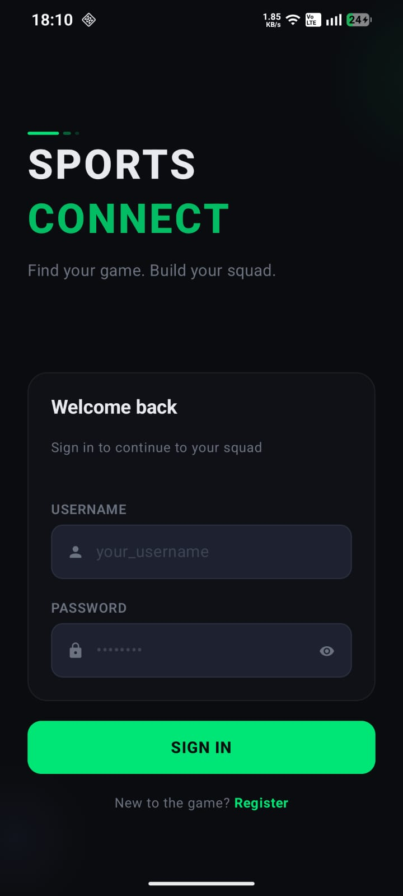
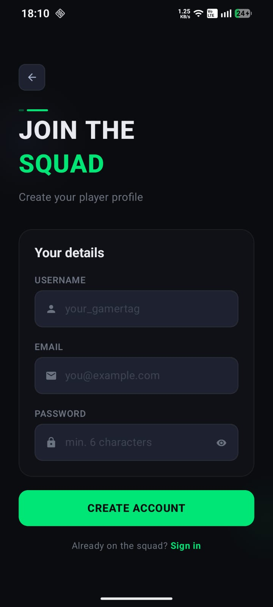
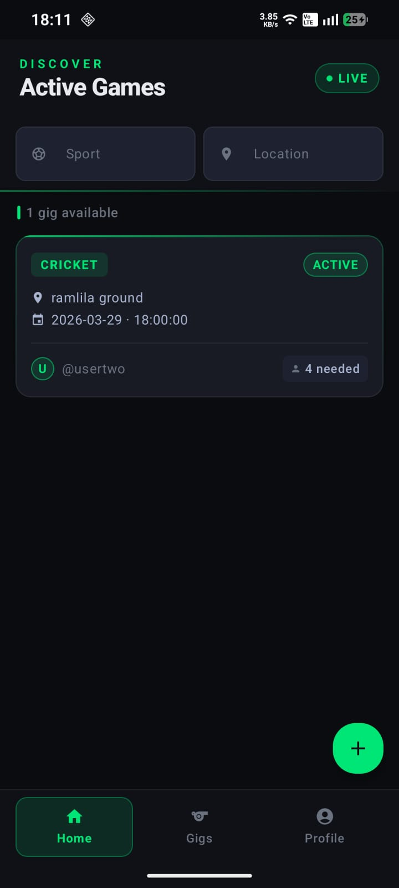
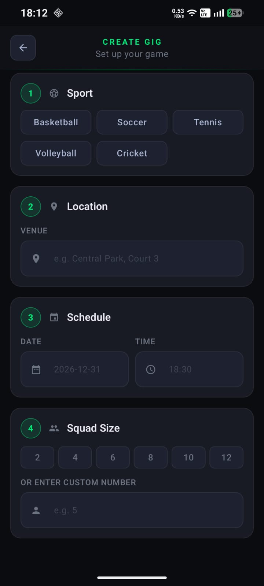
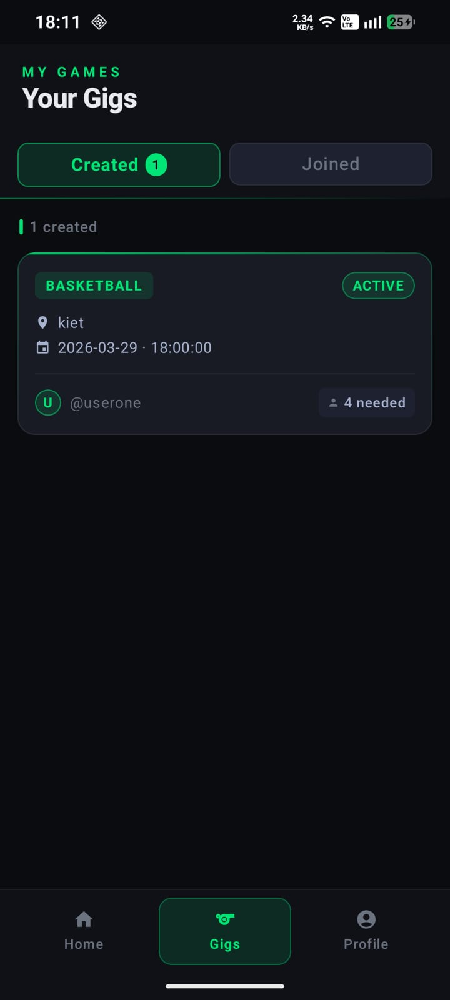
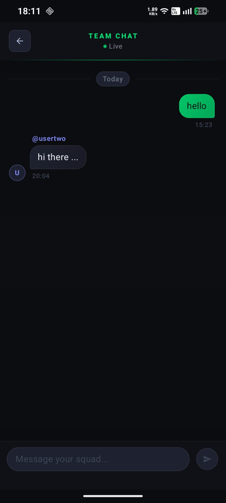
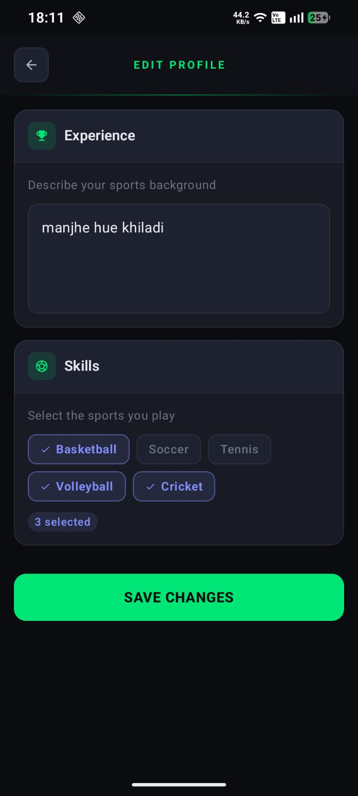
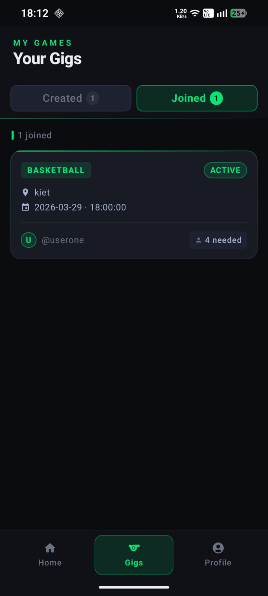
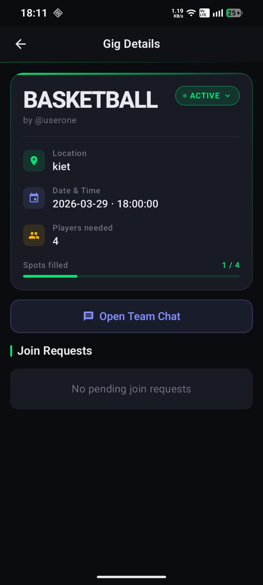
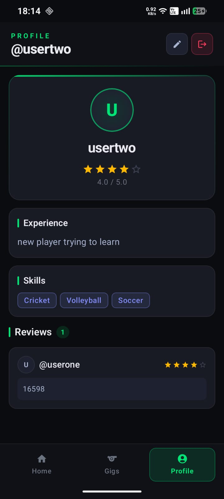

# SportsConnect

SportsConnect is your one-stop mobile solution to connect with sports enthusiasts, discover local games, organize events, and build your athletic network. Whether you're a seasoned player or just looking for a casual game, SportsConnect makes it easy and fun to stay active and social.

## 🚀 Features

- Find and join sports events nearby
- Create and organize your own games
- Connect with like-minded players and teams
- Real-time notifications and updates
- User-friendly, intuitive experience

## 🛠️ Tech Stack

- **Kotlin (100%)**: Core app language
- **Coroutines**: Asynchronous programming
- **Retrofit & OkHttp**: For network API calls
- **Hilt**: Dependency Injection framework
- **Jetpack**: MVVM architecture (LiveData,Flows(cold & hot), ViewModel, Navigation, Room, etc.)
- **Material Design**: UI/UX components
- **Android Studio**: Development environment

<!-- 3x3 Image Grid (Replace each src with your actual image file paths or URLs) -->
## 📸 Screenshots

<table>
  <tr>
    <td align="center">
       
      <b>Login</b>
    </td>
    <td align="center">
       
      <b>Register</b>
    </td>
    <td align="center">
       
      <b>Home</b>
    </td>
  </tr>
  <tr>
    <td align="center">
       
      <b>Create Gig</b>
    </td>
    <td align="center">
       
      <b>Created Screen</b>
    </td>
    <td align="center">
       
      <b>Chat Screen</b>
    </td>
  </tr>
  <tr>
    <td align="center">
       
      <b>Edit Profile</b>
    </td>
    <td align="center">
       
      <b>Joined Gigs</b>
    </td>
    <td align="center">
       
      <b>MyGig Details</b>
    </td>
  </tr>
  <tr>
    <td align="center">
       
      <b>User Profile</b>
    </td>
    <td></td>
    <td></td>
  </tr>
</table>

## ⭐ Get Involved

1. Fork this repo
2. Clone it: `git clone https://github.com/anshq31/SportsConnect-frontend-.git`
3. Open with Android Studio and run on your device/emulator

---

Made with ❤️ by [anshq31](https://github.com/anshq31)
